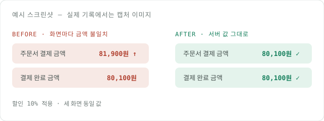

## 배경 — 무슨 문제로 시작했나

같은 상품의 최종 결제 금액이 **장바구니·주문서·결제 완료 화면에서 서로 다르게** 표시된다는 CS가 반복됐다.
원인을 좇아 보니 세 화면이 각자 **클라이언트에서 할인율을 다시 계산**하고 있었고, 반올림 시점과 쿠폰 중복 처리 순서가 화면마다 달랐다.

## 검토한 방향 — 어떤 선택지가 있었나

- **A. 클라이언트 계산 유지 + 반올림 규칙 통일** — 공용 유틸로 계산을 한 곳에 모으되 계산 자체는 프론트에 둔다.
- **B. 서버 단일 계산 · 클라이언트는 표시만** — 할인·쿠폰·반올림을 서버가 계산해 내려주고 프론트는 그대로 렌더링한다.
- **C. BFF 계층에서 계산** — 별도 BFF를 두어 계산을 중계한다.

## 트레이드오프와 결정 — 무엇을 왜 골랐나

**A**는 변경 범위가 작지만 결제 금액의 진실을 여전히 클라이언트가 소유해, 새 화면마다 같은 버그가 재발할 구조라 버렸다.
**C**는 계산 소유권은 옮겨오지만 지금 팀·트래픽 규모에서 운영할 계층이 하나 늘어나는 비용이 이득을 넘었다.
결국 **B**를 택했다. 금액의 단일 진실 소스를 서버로 옮기면 화면 수가 늘어도 불일치가 구조적으로 불가능해진다.

## 결과 — 실제로 어떻게 됐나

배포 후 2주간 금액 불일치 CS는 0건. 재현 테스트를 먼저 추가해 실패를 확인한 뒤 수정했고, 경계값(0원·쿠폰 중복·반올림)을 회귀 테스트로 고정했다.

## 남은 것

- 서버 계산 결과 캐시 무효화 시점 — 쿠폰 만료와의 경계 케이스 후속 확인 필요
- 레거시 관리자 화면 1곳은 아직 클라이언트 계산 사용 — 다음 스프린트에서 이관
